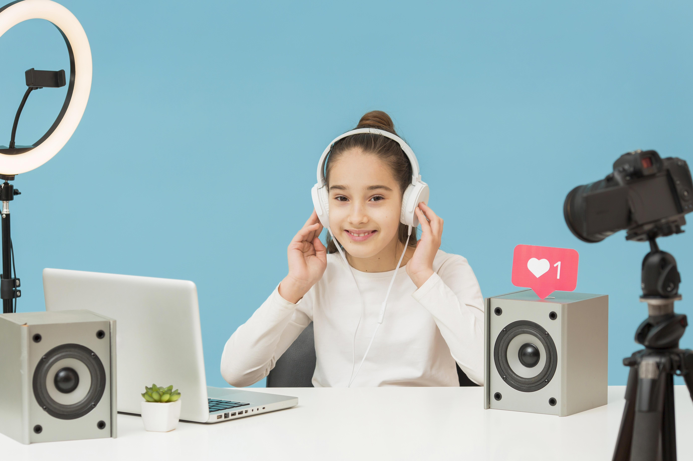

# 如何做英语教育的自媒体？

* [1.谁适合做？](##1，谁适合做英语直播？)
* [2.如何积累粉丝量？](##2，如何积累粉丝量？)
* [3.如何做抖音直播？](##3，如何做抖音直播？)
* [4.如何做视频号直播？](##4，如何做视频号直播？)

## 1，谁适合做英语直播？
短视频为创业者提供了一个极其方便的平台，在这个平台上每个都都可打造自己的个人IP，方便而快捷，所以人人都可以做，常见的误区如下：
##### ~~我不是英语专业或者英语老师‌~~
其实不需要，在平台上大多是初级或者中级的英语爱好者和学习者，并不要太专业和高深的英语知识，相反即使名校的专业英语教授缺很难做成功，这个因为短视频平台提供了一个更加广泛的可能性，有的英语知识简单但是正好切中的英语学习的痛点，有的简单但是却有趣大家愿意跟着听跟着看，有的本身在线下有帮助英语教学，同步把这些线下感兴趣的内容传递到网上等等。
##### ~~我不会视频拍摄和剪辑~~
有视频剪辑能力固然好，可以让你的视频更完美更专业，但是记住“内容为王”你的内容是大家感兴趣的或者有用的就够了。当然视频拍摄和剪辑并不难，你可以边做边学，或者在开头模仿别人，口播都是可以的。
##### ~~我不想出镜~~
所有短视频平台都提倡真人出镜，可以获得更好的流量。但是同样有成功的粉丝多达几十万的博主通过语音或者聊天室的方式成功了

---&zwnj;**？那么需要哪些条件呢？**&zwnj;

#### 有较多的空余时间
有较多的空余时间是最好的，你需要花费时间去学习成功人士的经验和视频直播内容，关注其中你最关心的几个作为初期模仿或者参考对象。并且短视频剪辑是费时费力的，你需要借助一些技术手段和批量制作技术帮助你
#### 爱好英语
爱好英语是做英语自媒体的前提，爱好才会有兴趣，才会不断探索和调整，才会坚持下去
#### 要坚持
从零起步是需要坚持的，不能应为短视频关注量少轻易放弃，也不能因为直播人少而失去动力。你所要做的是及时调整，及时改变方式，找到适合你的风格和用户群

    

## 2，如何积累粉丝量？
   积累粉丝是一个有趣和激动人心的过程，主要通过发表短视频和直播获得
#### 短视频
   推荐每天发2-4个短视频：并且在固定的时间点发送，时间点通常选取大家有空的时间，比如早上7：00-9：00 中午12：00-14：00 下午18：00 -22；00 ，这个时间点粉丝通常会有时间并习惯拿起手机刷
   推荐借鉴和学习：原创很好，但是会耗费大量的时间，推荐批量制作，定点发送，借鉴和剪辑有趣并适合的视频素材
   也可以求助于我，通过技术的方式帮助你批量剪辑，定点发送
#### 直播
   直播无疑是涨粉最好最快最直接的方式，推荐每天2小时直播，并且在直播时候及时互动
#### 及时互动
   对你自己的短视频及时给与回复评论点赞，这些正向动作都会帮助平台推荐给更多的人观看

    

## 3，如何做抖音直播？
#### 下载抖音直播伴侣
   这是抖音官方的PC直播软件，功能简单直接，适合新手。
   在抖音官网搜索“直播伴侣”下载。或者点击这里下载：https://streamingtool-hl.douyin.com/

#### 开播选择 “视频”
   可以用自己的原创课程，或者有版权的内容来播放直播
   同时链接好自己的手机摄像头
   一边直播课程一边可以参与讲解或者和粉丝互动
#### 开播选择 “视频”
   可以通过在电脑播放语音软件，播放英语听力训练等
   自己要守候在电脑旁边一边应对抖音的有人验证
   

    

## 4，如何做视频号直播？
#### 下载电脑端微信
   视频号直播不要要下载额外的软件，只需要电脑端微信。
   点击这里下载：https://www.wechat.com/

#### 开播选择 “视频”
   可以用自己的原创课程，或者有版权的内容来播放直播
   同时链接好自己的手机摄像头
   一边直播课程一边可以参与讲解或者和粉丝互动
总结：
手机开播： 微信发现页 → 视频号 → 个人中心 → 发起直播 → 设置封面标题 → 开始直播
电脑开播： 微信电脑端打开“三”菜单，最上方可以下载官方【视频号直播助手】 → 扫码登录 → 添加素材 → 开始直播

:smile::smile::smile::smile::smile:

    

